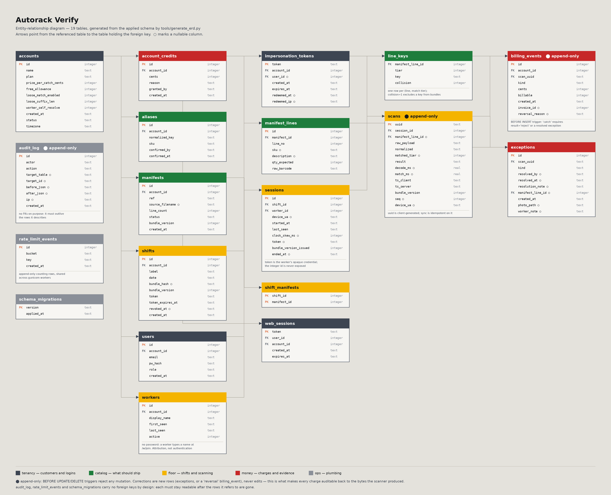

# Autorack Verify

Barcode verification for small warehouses. It runs alongside whatever WMS or
paper process is already in place: the owner uploads a pick or ship manifest,
floor workers scan items with a phone camera or a Bluetooth wedge scanner, and
the app tells them immediately whether the item belongs on the shipment.

- **Wrong item** → hard reject before it leaves the dock.
- **Already scanned** → duplicate warning.
- **Correct** → confirmed, and the line is marked.

Built for 10–60 workers and no IT staff. A shift needs one printed QR code on
the wall and phones the workers already own.

Billing is per error caught: a number of free catches, then a flat rate per
prevented mis-ship. Because a rejection is what generates a charge, every
rejection is traceable back to the raw bytes the scanner produced.



## Contents

- [How a shift works](#how-a-shift-works)
- [The three surfaces](#the-three-surfaces)
- [Working offline](#working-offline)
- [The matching engine](#the-matching-engine)
- [Cross-platform normalization](#cross-platform-normalization)
- [Billing integrity](#billing-integrity)
- [Workers and attribution](#workers-and-attribution)
- [Architecture](#architecture)
- [Where the SQL lives](#where-the-sql-lives)
- [Running it locally](#running-it-locally)
- [Deployment](#deployment)
- [Operator GUI](#operator-gui)
- [Backups](#backups)
- [Savings reports](#savings-reports)
- [Development](#development)

## How a shift works

1. The owner uploads a manifest (CSV, TSV, or pasted text). Columns are
   auto-detected; the preview shows what was found before anything is
   committed.
2. The owner prepares a shift and assigns one or more manifests to it. The
   server builds a bundle containing every line and every derived lookup key,
   and prints a wall QR code.
3. Workers scan the QR with their phone, type their name, and the shift data
   downloads once. From that point the phone needs no network.
4. Workers scan items. Each scan gets one of three answers — OK, REJECT, or
   DUPLICATE — as a full-screen colour before any text, readable at arm's
   length in a noisy aisle.
5. Scans sync back whenever there is signal. The owner watches the floor view
   live, reviews anything the system could not resolve, and sees the running
   savings on the billing dashboard.

## The three surfaces

**Worker PWA** (`/w`) — phone-first and installable. Near-zero chrome, huge
type, one job. English and Spanish, chosen on the join screen.

The camera is worker-controlled rather than always-on: tapping the camera
button opens a 15-second window with a visible countdown, then shuts off on
its own. Manual barcode entry is always available, because a damaged or
unreadable label defeats both the camera and a wedge scanner.

A worker who disagrees with a REJECT can appeal it by taking a photo, when the
account has that option enabled. Appeals queue offline-safe exactly like scans
and are reviewed by the owner before they affect billing.

Logging out stops the camera, flushes pending scans, warns if any are still
unsynced, and shows an end-of-shift summary in counts — scanned, caught,
duplicate, needs review. No dollar figures: that framing belongs on the
owner's Workers page, not on the phone of the person being measured.

**Owner web app** — signup, manifest upload, shift preparation, live floor
view, exception review, per-worker statistics, and a savings dashboard.

Manifests stay editable after they are committed. `/manifests/<id>` is a
paginated line editor that adds, edits, or deletes lines and regenerates the
match index immediately; any shift already using that manifest has its bundle
version bumped so connected phones know to refresh. Pagination happens in SQL,
so a 15,000-line manifest never loads into memory at once.

`/workers` can rename a worker (fixing a typo'd duplicate like "Bob" versus
"bob"), deactivate someone who has left, or merge one worker into another.
Merging reassigns their sessions — and therefore their scans and billing
history — without touching the append-only records themselves.

Every timestamp renders in the account's own timezone. Storage stays UTC
throughout; the conversion is display-only.

**Operator GUI** (`admin_gui.py`) — a Tkinter desktop application with nine
tabs for running the service: accounts, live feed, tables, SQL console,
billing, manifests and shifts, backups, server control, and an overview.

Password reset is handled by a person, not a link. There is no reset-email
flow: a locked-out owner emails from the address they signed up with, the
operator verifies that and generates a new password in the Accounts tab, shown
once with a copy button to relay back. The same tab creates accounts and their
first owner together, and manages users on existing accounts. It will not
delete an account's last owner, since that would leave nobody able to log in.

## Working offline

A shift has to survive eight hours in a metal building with no signal.

**Bundle handoff.** A QR code holds a few kilobytes, nowhere near a full
manifest, so the wall QR carries a single-use, expiring token rather than
data. The phone exchanges it for the bundle once, gzipped, and stores it in
IndexedDB. A header chip always shows the bundle date, the line count, and
whether the data is current — a worker should never have to guess whether they
are working from live information.

**Outbox sync.** Every scan is written to a local outbox *before* any network
attempt, with a client-generated UUID and a sequence number. A background loop
drains it in batches whenever the phone is online. Sync is idempotent on that
UUID, so a phone that double-sends after a dropped response, or dies mid-batch
and resends after a reboot, produces the same result — never duplicates.

**Conflict rule.** If two workers scan the same line in one shift, the first
to reach the server wins the OK and the second becomes a duplicate. Both
records are kept. Scan history is append-only; corrections are new records,
never edits.

**Mid-shift changes.** Editing a manifest bumps the bundle version on every
shift using it. Connected phones notice within 30 seconds and show "Bundle
stale — reconnect". A scan made against stale data is still recorded, but is
not billed until the phone refreshes.

**Clock skew.** Client and server timestamps are stored separately and never
overwrite each other. Skew is measured and recorded per sync round, and is
visible to the operator. Billing always keys off server arrival order.

## The matching engine

A scanned payload is normalized — control characters stripped, uppercased,
GS1 element strings parsed, GTINs canonicalized (UPC-E → UPC-A → EAN-13 →
GTIN-14) — and then looked up across seven tiers in a fixed order. Matching
stops at the first tier producing **exactly one** candidate. A tier with zero
or several candidates yields nothing and falls through. If every tier is
exhausted or ambiguous, the result is *unresolved* — never a guess.

| Tier | Match on | Confidence | Example |
|---|---|---|---|
| 0 | Raw string, byte-identical | certain | Manifest and scan are both `"012345678905"`. |
| 1 | Normalized string | certain | Manifest has `"  012345678905"` from an Excel export; the scanner sends `"012345678905"`. |
| 2 | Canonical GTIN-14 | certain | Manifest has UPC-A `"025300000208"`; the phone reads the same carton as UPC-E `"02532038"`. |
| 3 | Digits only, leading zeros stripped | high | Manifest stores `"00012345678905"`; an 11-digit scan `"12345678905"` shares the zero-stripped digits. |
| 4 | Body with check digit removed | high | Manifest exported without the check digit; the phone reads the full code. Works in both directions. |
| 5 | Learned alias | certain | A vendor's proprietary code was unresolved once; the owner resolved it and chose to remember the mapping. Account-scoped from then on. |
| 6 | Last-N-digit suffix (opt-in) | low | Two codes share only their trailing digits. Off by default; a match here is flagged for confirmation rather than counted. |

**Lookup order is not tier order.** The engine tries:

```
RAW → NORMALIZED → GTIN14 → ALIAS → DIGITS_STRIPPED → BODY_NO_CHECK → SUFFIX
```

The learned alias is tried *ahead of* the two loose numeric tiers, because an
owner-taught alias is a confirmed correction and must not be outranked by an
automatic guess. Ordered the other way, teaching an alias and then adding an
unrelated line whose loose key happens to collide would silently redirect
every future scan to the wrong line.

**Collision analysis at ingest.** When a manifest is committed, the loose
tiers are checked for keys shared by more than one line. Any such key is
flagged, the owner is warned, and that exact key — not the whole manifest — is
excluded from the bundle. This applies the ambiguity guard in advance and
visibly, rather than at scan time.

## Cross-platform normalization

The matching engine exists twice: in Python on the server, and in JavaScript
on the phone. Both must turn the same physical label into the same lookup key,
byte for byte, or the same barcode resolves differently depending on which
side computed it.

That is harder than it sounds, because the languages disagree about
whitespace. Python's `str.strip()` treats the ASCII separator block
`\x1c`–`\x1f` — which includes the GS byte GS1 barcodes use as a field
separator — as whitespace and removes it. JavaScript's `.trim()` does not
touch those code points at all:

```python
>>> "\x1dXYZ\x1d".strip()
'XYZ'
```
```js
> "\x1dXYZ\x1d".trim()
'\x1dXYZ\x1d'   // unchanged
```

Neither implementation calls its language's built-in. Both define the same
explicit character set and strip matches from anywhere in the string. The test
suite extracts the real functions from both files and asserts identical output
across a set of adversarial inputs including embedded separators, NUL bytes,
and mixed GS1 payloads.

GS1 parsing needs those separators intact to find where variable-length fields
end, so structure is parsed on a lightly trimmed copy of the raw payload
*before* the aggressive strip that produces the lookup key. Both requirements
are real, and sequencing them this way is what satisfies both.

## Billing integrity

A billable catch is a **reject** — a scan confidently determined to match
nothing in the shift's manifests. Never an OK or a duplicate, however
confident the match. Scan results have four values for this reason:

- **ok** / **duplicate** — resolved to a real line. Never billable.
- **reject** — every tier returned zero candidates, and no tier hit the
  ambiguity guard along the way. Confident absence. Billable.
- **unresolved** — some tier found several candidates before falling through.
  This is not confidence that the item is wrong, only that the system cannot
  tell. Never billed automatically. The owner reviews it and either teaches an
  alias or confirms it as a genuine wrong item.

Because a phone has to classify a scan while offline, that judgement is made
on the client — so the automatic billing path never takes the client's word
for it. The server independently rebuilds the same index and recomputes the
match. Only if it agrees does the catch bill. A disagreement files a review
item with the server's own matched line attached, so a client claiming a
reject it cannot justify surfaces for a human instead of quietly charging the
account.

Underneath that, the database itself enforces the rule: a trigger blocks any
catch record unless the referenced scan is a confident reject or carries a
resolved exception. Scans, billing records, and the audit log are all
append-only, enforced by triggers rather than by convention. A billing
correction is a reversal record with a typed reason, never an edit.

Every privileged action — operator and owner alike — writes to the audit log:
account edits, credits, impersonation links, manifest commits and line edits,
shift preparation and revocation, worker changes, exception resolutions,
logins, logouts, and worker appeals. Edits are audited *before* the mutation,
on their own commit, so the trail survives a mutation that later fails.
Creations are audited inside the same transaction, since an audit record for
something that rolled back would be a false record.

Pricing constants live in exactly one module. The billing engine, the owner's
dashboard, and the public pricing page all read from it, and a test renders
the real page and fails if any displayed number cannot be traced back to that
module.

## Workers and attribution

Floor workers do not have accounts, passwords, or PINs. A worker record is
created the first time someone types a name on the join screen:

```
scan wall QR → type a name → session created
```

Authorization is possession of the shift's QR token, which authorizes the
*shift*. The name exists for attribution, not authentication — requiring
credentials from temporary floor staff kills adoption, and the QR is already
physically controlled by being on the wall of the building.

Because names are matched exactly, "Bob" and "bob" are two records. That is
why the Workers page has rename and merge.

## Architecture

```
barcode.py             normalization + tiered matching engine (the core)
static/js/barcode.js   the same engine in JS, byte-parity tested
db.py                  SQLite access layer -- named functions, no ORM
sqlstore.py            loads sql/*.sql into SQL["file.name"]
sql/*.sql              every static query, one file per entity
migrations/*.sql       schema, applied in order
manifest_ingest.py     parsing, column detection, collision analysis, bundles
seed.py                demo account + 3 manifests, for local development only
auth.py                PBKDF2 hashing, opaque session tokens
i18n.py                English/Spanish strings for the worker PWA
billing.py             catches, reversals, savings
pricing.py             the one place pricing constants live
backup.py              hot database + appeal-photo backups, retention, restore
reports.py             standalone HTML savings reports
tz.py                  account-timezone display (storage stays UTC)
app.py                 Flask: worker PWA (/w) + owner app + marketing (/)
admin_api.py           operator operations, shared by local and remote GUI
admin_gui.py           Tkinter desktop app -- the operator's admin surface
reset_data.py          wipe operational data, keep the schema
tools/generate_erd.py  regenerates docs/erd.png from the applied schema
templates/, static/    Jinja templates and vanilla CSS/JS per surface
tests/                 pytest, one file per concern
```

Everything reaches the database through `db.py` and the matching engine
through `barcode.py`. The web app and the desktop app are both consumers of
that logic rather than owners of it, which is why two very different frontends
can answer "why did this reject" without either duplicating the other.

The stack is deliberately small: Flask, SQLite, Jinja, and vanilla JavaScript.
No ORM, no build step, no CDN dependency. The worker PWA has to render
correctly after eight hours in airplane mode from a single page load, so no
surface depends on a webfont or a runtime download.

## Where the SQL lives

Static query text lives in `sql/*.sql`, one file per entity, loaded by
`sqlstore.py` and addressed by name:

```sql
-- sql/accounts.sql
-- name: get_account
SELECT * FROM accounts WHERE id = ?;
```

```python
def get_account(conn, account_id):
    return query_one(conn, SQL["accounts.get_account"], (account_id,))
```

A query can be pasted straight into a SQLite shell without unpicking string
concatenation, editors highlight it, and a schema change shows up in the same
diff as the queries it affects.

Every file is parsed at import, so a malformed file fails at startup. Lookup
keys are checked separately: the test suite walks the AST of every module and
asserts each key resolves to a real statement and that no statement is
orphaned. Another test compiles every shipped statement against the real
schema, so a column renamed by a migration fails the suite rather than one
page.

The loader does no interpolation — parameters go through SQLite's own
placeholder binding. Six statements are assembled in Python because they
genuinely cannot be static (a table name chosen at runtime, a variable-length
`IN` list, an update whose columns depend on which fields were supplied). Each
carries the allowlist that constrains it in the same function.

## Running it locally

**Python 3.12 or newer is required**, not merely recommended. `db.migrate()`
sets `sqlite3.Connection.autocommit`, which is the only way to get real manual
transaction control that DDL participates in -- so a migration that fails
halfway rolls back cleanly instead of leaving a half-applied schema. That
attribute did not exist before 3.12. `pyproject.toml` targets `py312` for
ruff and mypy, and this is the runtime counterpart of that.

```bash
python3 -m venv .venv && source .venv/bin/activate
pip install -r requirements-dev.txt
python -m pytest tests/ -q

python serve.py
```

`serve.py` creates the database, seeds demo data, detects the LAN IP,
generates a self-signed certificate, serves over HTTPS, and prints the LAN URL
with an ASCII QR code you can point a phone at.

Browsers will warn about the self-signed certificate; accept it to continue.
Phone cameras require HTTPS or localhost, so there is no way around serving
TLS even locally.

```bash
python serve.py --offline-drill
```

seeds a shift, prints its join QR, and blocks sync with a 503 for 60 seconds,
so the offline path can be demonstrated rather than assumed: join on a real
phone, let the bundle download, switch to airplane mode, scan, then reconnect
and watch the outbox drain into the floor view.

Demo login, printed by `serve.py` on first run:
`owner@dockside-demo.test` / `dockside-demo-2026`. Demo data is only ever
created by `serve.py`; the production entrypoint never seeds.

## Deployment

Run under `gunicorn` with Caddy in front for TLS:

```
verify.example.com {
    reverse_proxy 127.0.0.1:8000
}
```

```bash
gunicorn --workers 4 --bind 127.0.0.1:8000 --access-logfile - "app:create_app()"
```

A systemd unit with `Restart=always` around that command is the recommended
way to keep it running on a small on-premises box, which is the target this
stack is built for. `serve.py`'s self-signed certificate is for local
development only.

Two things follow from running multiple worker processes:

- The application secret is read from `data/secret_key` (mode `0600`, created
  on first run) rather than generated per process, so every worker agrees on
  it. CSRF tokens derive from it. Keep this file with the database when moving
  an installation; losing it invalidates open sessions but touches no data.
- Login and signup rate limiting is stored in the database rather than
  per-process memory, so all workers share one budget and a restart does not
  hand an attacker a fresh one. Counting is a windowed query over append-only
  rows, so simultaneous hits cannot lose one to a race.

### Before it is reachable from the internet

The design target is one warehouse on a trusted network, provisioned by hand.
Exposing signup publicly enables a path that hand-provisioning never uses, so
confirm each of these first:

1. **Real TLS.** A domain, DNS pointed at the host, and Caddy actually
   running. None of that is code in this repository.
2. **Dependency audit on every release.** `pip-audit -r requirements.txt`,
   as part of the release process rather than once.
3. **An independent security review.** The security work here was done and
   verified by its author, which is not the same thing as reviewed by someone
   who did not write it.
4. **Decide how signups are gated.** Signup is rate-limited per IP and
   validates addresses, but this stack ships no mail transport, so there is no
   email verification step. If you need one, add a mail transport first.
5. **Keep `data/` off any public host path.** It holds the database, the
   application secret, the operator API token, and worker appeal photos.

## Operator GUI

```bash
python admin_gui.py --db data/app.db
```

The GUI never touches SQLite directly. Every tab goes through one operation
layer that either opens a local connection or posts the same operation names
to a deployment over HTTP — one implementation either way.

Remote mode exists for hosts that offer no SSH or filesystem access. Mint a
token on the server once:

```bash
python admin_api_token.py --show
```

Then, from your own machine:

```bash
python admin_gui.py --remote-url https://your-host.example.com --token-file ~/.autorack_admin_token
```

The token is a credential equivalent to full operator access — including
unsafe SQL writes and password resets — over the network. `--token-file` keeps
it out of shell history. The URL must be HTTP or HTTPS; anything else is
rejected at startup, because the underlying library would otherwise open a
local file path and parse it as an API response.

Remote mode differs in three ways: the server start/stop controls are disabled
(they spawn a local process, which means nothing against a remote host);
backups download to your machine and the automatic timer is off, since
shipping a full database copy over HTTP every 30 minutes is real load on
someone else's host; and the live feed polls less aggressively.

## Backups

The database holds almost all state. The exception is worker appeal photos,
stored on disk and referenced by path, so a backup is a paired snapshot of
both, tagged with the same timestamp.

- Backups land in `backup_data/`, never inside `data/`.
- The database half uses SQLite's online backup API, which is safe to run
  against a live database in WAL mode with no need to stop the server.
- `serve.py` takes one on every startup, before running migrations.
- The operator GUI takes one every 30 minutes while open, and has manual
  backup and restore buttons. Restoring takes a safety copy of current state
  first; restoring photos only adds and overwrites, never deletes.
- Retention keeps the 30 most recent of each type.

Filenames are UTC, because retention sorts on them and a local clock that
falls back an hour at the end of daylight saving would otherwise order two
backups wrongly and prune the newer one.

This does not replace off-box backups. It guards against a bad migration, a
mistyped SQL statement, or a botched restore — not against losing the machine.

`reset_data.py` wipes all operational data while leaving the schema intact,
for returning an installation to zero after testing:

```bash
python reset_data.py --db data/app.db          # dry run
python reset_data.py --db data/app.db --yes    # wipe
```

It takes a safety backup first, and because the append-only tables are
protected by triggers, it drops them, deletes, then recreates them verbatim
from the definitions read out of the live schema — not hardcoded copies — and
verifies they came back before reporting success.

## Savings reports

Triggered from the operator GUI's Billing tab, for one account or all of them.
Each report is a single self-contained HTML file with inline styles, so it
opens directly from disk and prints cleanly to PDF through the browser. That
avoids adding a PDF-rendering dependency to the stack.

Contents: money saved to date, mis-ships caught, free allowance, net amount
owed, and a per-worker breakdown — computed by the same query that backs the
owner's Workers page, so there is no second code path producing these numbers.

## Development

```bash
pip install -r requirements-dev.txt
ruff check .          # lint
ruff format --check . # formatting
mypy                  # types
pytest -q             # test suite
```

All four are clean and enforced in CI. Configuration lives in
`pyproject.toml`.

Two things worth knowing about CI:

- **Node is required.** The JavaScript/Python parity tests skip themselves
  when `node` is unavailable. That is correct on a laptop and wrong in CI —
  without Node, the tests proving both matching engines agree would silently
  not run while the build stayed green. The workflow installs Node and then
  asserts those tests did not skip.
- **The diagram check compares the schema, not the image.** PNG output is not
  reproducible across machines, since it depends on the installed fonts and
  imaging library. After a migration, regenerate both:

  ```bash
  python tools/generate_erd.py
  python tools/generate_erd.py --dump-schema docs/schema.json
  ```

Type checking covers shipped code rather than tests. With untyped function
bodies checked, nearly every error inside the test suite is the same one — a
lookup that is honestly typed as optional, indexed directly by a test that
just created the row — and silencing those adds assertions without adding
safety.
